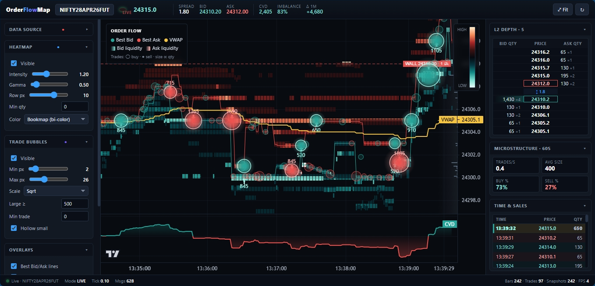

<p align="center">
  
</p>

<h1 align="center">OrderFlowMap</h1>

<p align="center">
  <b>A Bookmap-style order flow visualization tool built entirely in the browser.</b><br>
  Real-time heatmaps · Trade bubbles · DOM ladder · Volume profile · CVD · Liquidity wall detection
</p>

<p align="center">
  <a href="#features">Features</a> •
  <a href="#live-demo">Live Demo</a> •
  <a href="#quick-start">Quick Start</a> •
  <a href="#live-mode">Live Mode</a> •
  <a href="#architecture">Architecture</a> •
  <a href="#keyboard-shortcuts">Shortcuts</a> •
  <a href="#contributing">Contributing</a> •
  <a href="#license">License</a>
</p>

---

## What is OrderFlowMap?

**OrderFlowMap** is a **zero-dependency, single-file** order flow visualization tool inspired by [Bookmap](https://bookmap.com/). It renders a real-time heatmap of the order book depth alongside trade executions, giving you an institutional-grade view of market microstructure — all inside a single HTML file.

It works in two modes:

| Mode | Description |
|------|-------------|
| **Simulate** | Generates synthetic NIFTY futures data with realistic market dynamics including sweeps, icebergs, and regime shifts. Perfect for learning and experimentation. |
| **Live** | Connects to a self-hosted [OpenAlgo](https://github.com/marketcalls/openalgo) WebSocket server running on your machine to stream real market data from Indian exchanges (NSE, NFO, BSE, MCX, CDS). |

---

## Features

### 🔥 Order Book Heatmap
- Real-time L2 depth visualization with configurable intensity, gamma correction, and row height
- Four color schemes: **Bookmap** (bi-color bid/ask), **Mono**, **Inferno**, **Viridis**
- Per-tick bucketing ensures accurate price-level aggregation
- Interactive colorbar legend with HIGH/LOW indicators

### 🫧 Trade Bubbles
- Every trade is plotted as a circle at its exact price and time
- Bubble size scales with quantity (sqrt, log, or linear)
- Large trades get a glowing halo effect for instant visibility
- Small trades can be rendered as hollow circles to reduce visual noise
- Configurable thresholds for minimum trade size and "large" trade classification

### 📊 Overlays & Analytics
- **Best Bid/Ask lines** — real-time BBO tracking with color-coded series
- **Session VWAP** — volume-weighted average price tracked across the session
- **Volume Profile** — horizontal histogram anchored to the right edge with POC (Point of Control) highlighted
- **CVD (Cumulative Volume Delta)** — separate pane with baseline coloring (green above zero, red below)
- **Large-trade arrows** — marker arrows on the price chart for significant executions
- **Liquidity wall detection** — algorithmic identification of persistent, abnormally large resting orders with dashed-line annotations and labeled tags
- **Sweep flash alerts** — on-chart banner when aggressive sweeps are detected in simulation

### 📋 DOM Ladder
- 5-level depth-of-market ladder with bid/ask quantities, order counts, and proportional bars
- Spread row with real-time spread calculation
- Crosshair-linked price highlighting

### 🖨️ Time & Sales (Tape)
- Scrollable trade tape showing the last 80 prints
- Color-coded by side (buy/sell) with large-trade highlighting
- Tabular-nums font for aligned, scannable data

### 📈 Microstructure Stats
- Trades per second, average trade size
- Buy/Sell percentage split (60-second rolling window)
- 1-minute delta display in the header

### ⌨️ Presets & Keyboard Shortcuts
- One-click presets: **Scalper**, **Swing**, **HFT**, **Clean**
- Full keyboard control (see [Keyboard Shortcuts](#keyboard-shortcuts))

---

## Live Demo

Simply open `index.html` in any modern browser — no build step, no server, no dependencies to install.

```
# Clone the repo
git clone https://github.com/YOUR_USERNAME/OrderFlowMap.git

# Open in browser
start OrderFlowMap/index.html        # Windows
open OrderFlowMap/index.html          # macOS
xdg-open OrderFlowMap/index.html      # Linux
```

The app starts in **Simulate** mode with 3 minutes of pre-seeded NIFTY data streaming at 4× speed.

---

## Quick Start

### Simulation Mode (Default)

1. Open `index.html` in your browser
2. The simulator auto-starts with synthetic NIFTY data at ~24,500
3. Use the left panel to tweak heatmap intensity, bubble sizes, and toggle overlays
4. Use the speed selector (top-right) to control simulation speed (1× to 20×)
5. Press **Space** to pause/resume, **F** to fit the chart

### Live Mode

1. Click **Live** in the Data Source panel
2. Enter your WebSocket URL (default: `ws://127.0.0.1:8765`)
3. Enter your [OpenAlgo](https://github.com/marketcalls/openalgo) API key
4. Set the symbol (e.g., `RELIANCE`, `NIFTY28APR26FUT`), exchange, and tick size
5. Click **⚡ Connect**

See [Live Mode Setup](#live-mode) for detailed instructions.

---

## Live Mode

### Prerequisites

OrderFlowMap connects to live market data through a **self-hosted WebSocket server**. You must run [OpenAlgo](https://github.com/marketcalls/openalgo) on your own machine — OrderFlowMap connects to this local endpoint and renders the incoming data.

> **Important:** OrderFlowMap is a pure front-end visualizer. It does **not** include a data server. You need to set up and run the OpenAlgo WebSocket server yourself.

### Setting Up OpenAlgo (WebSocket Server)

1. **Clone the OpenAlgo repository:**
   ```bash
   git clone https://github.com/marketcalls/openalgo.git
   cd openalgo
   ```

2. **Follow the OpenAlgo setup instructions** in their [README](https://github.com/marketcalls/openalgo#readme) to:
   - Install dependencies
   - Configure your broker credentials
   - Start the WebSocket server (default: `ws://127.0.0.1:8765`)

3. **Verify the server is running** — the OpenAlgo WebSocket server should be listening on port `8765`

4. **Open OrderFlowMap** → switch to **Live** mode → click **⚡ Connect**

### Connection Flow

```
Browser (OrderFlowMap)                        Your Machine
    │                                    ┌──────────────────────┐
    │  WebSocket (ws://127.0.0.1:8765)   │                      │
    └───────────────────────────────────► │  OpenAlgo Server     │
                                         │  (self-hosted)       │
                                         │       │              │
                                         │       │ Broker API   │
                                         │       ▼              │
                                         │  Exchange Data Feed  │
                                         │  (NSE/NFO/BSE/MCX)   │
                                         └──────────────────────┘
```

### WebSocket Protocol

**1. Authentication**
```json
{ "action": "authenticate", "api_key": "YOUR_API_KEY" }
```
Response:
```json
{ "message": "Authentication successful" }
```

**2. Subscribe**
```json
{
  "action": "subscribe",
  "symbol": "RELIANCE",
  "exchange": "NSE",
  "mode": 3,
  "depth": 5
}
```

**3. Market Data (incoming)**
```json
{
  "type": "market_data",
  "data": {
    "ltp": 2450.50,
    "volume": 1234567,
    "ltt": 1713345678000,
    "depth": {
      "buy": [
        { "price": 2450.45, "quantity": 500, "orders": 12 },
        ...
      ],
      "sell": [
        { "price": 2450.55, "quantity": 300, "orders": 8 },
        ...
      ]
    }
  }
}
```

### Trade Detection

Since the WebSocket feed provides snapshots (not individual trade prints), OrderFlowMap reconstructs trades using **volume delta analysis**:

1. Compare `volume` between consecutive ticks
2. If `volume` increased → a trade occurred with `qty = volumeDelta`
3. Side is inferred by comparing current `ltp` with previous `ltp`:
   - LTP went **up** → classified as a **buy** (aggressive buyer lifted the ask)
   - LTP went **down** → classified as a **sell** (aggressive seller hit the bid)
   - LTP **unchanged** → side carries forward from the previous trade

### Supported Exchanges

| Exchange | Code | Description |
|----------|------|-------------|
| NSE | `NSE` | National Stock Exchange (Equity) |
| NFO | `NFO` | NSE Futures & Options |
| BSE | `BSE` | Bombay Stock Exchange |
| BFO | `BFO` | BSE Futures & Options |
| MCX | `MCX` | Multi Commodity Exchange |
| CDS | `CDS` | Currency Derivatives |

### Tick Size Configuration

Set the correct tick size for your instrument:

| Instrument | Tick Size |
|------------|-----------|
| NIFTY / BANKNIFTY Futures | `0.05` |
| Equity (NSE) | `0.05` |
| NIFTY / BANKNIFTY Options | `0.05` |
| MCX Gold | `1.00` |
| MCX Crude Oil | `1.00` |

---

## Architecture

OrderFlowMap is a **single HTML file** (~1,700 lines) with no build tooling, no framework, and a single external dependency:

### Dependency

| Library | Version | Purpose |
|---------|---------|---------|
| [Lightweight Charts™](https://tradingview.github.io/lightweight-charts/) | v5.0.9 | High-performance financial charting (via CDN) |

### Internal Structure

```
index.html
├── <style>          — Complete CSS design system (~210 lines)
├── <body>           — HTML layout with header, 3-column grid, footer
└── <script>         — Application logic (~1,250 lines)
    ├── Config & State
    ├── Utilities (clamp, mix, rgba, roundTick, gauss)
    ├── Color Maps (bookmap, mono, inferno, viridis)
    ├── Chart Setup (Lightweight Charts v5 initialization)
    ├── Custom Primitives
    │   ├── HeatmapPrimitive — L2 depth rendering + volume profile
    │   ├── WallsPrimitive   — Liquidity wall detection & annotation
    │   └── BubblesPrimitive — Trade bubble rendering with halo effects
    ├── Simulator Engine
    │   ├── Regime model (drift, volatility, sweeps, icebergs)
    │   └── Synthetic order book & trade generation
    ├── Live WebSocket Client
    │   ├── OpenAlgo auth/subscribe protocol
    │   ├── Trade detection via volume delta
    │   └── Real-time VWAP computation
    ├── Renderers (DOM ladder, tape, colorbar, alerts)
    ├── UI Controls (range sliders, checkboxes, presets)
    └── Boot sequence (seed history → start loop)
```

### Custom Primitives (Lightweight Charts v5 API)

OrderFlowMap uses the [Custom Series Primitives API](https://tradingview.github.io/lightweight-charts/docs/plugins/custom_primitives) to render the heatmap, bubbles, and walls directly on the chart canvas:

| Primitive | Render Layer | Description |
|-----------|-------------|-------------|
| `HeatmapPrimitive` | `bottom` | Renders L2 depth as colored rectangles + volume profile bars |
| `WallsPrimitive` | `top` | Detects and draws liquidity walls with labels |
| `BubblesPrimitive` | `top` | Draws trade circles with size ∝ quantity |

### Data Model

| Array | Per-second | Fields |
|-------|-----------|--------|
| `bars[]` | ✅ | `time`, `mid`, `bbid`, `bask`, `vwap`, `_vN`, `_vD` |
| `depth[]` | ✅ | `time`, `bids[{p, q, o}]`, `asks[{p, q, o}]` |
| `cvdBars[]` | ✅ | `time`, `value` (running cumulative delta) |
| `trades[]` | Per-tick | `time`, `price`, `qty`, `side` |
| `tradeVolByPrice` | Map | `price → cumulative volume` (for volume profile) |

### Simulator

The built-in simulator generates realistic market dynamics:

- **Regime model**: drift, volatility, sweep events, and iceberg orders evolve over time
- **Order book**: 5 levels per side with Poisson-like quantity distributions
- **Trade generation**: side probability is influenced by imbalance, drift, and sweep direction
- **Fat-tail trade sizes**: log-normal distribution with occasional 3–8× multiplier spikes
- **Sweep events**: ~1.2% chance per tick, creating aggressive directional pressure for 8–30 ticks
- **Iceberg orders**: ~0.8% chance per tick, adding hidden refill liquidity at a specific level

---

## Keyboard Shortcuts

| Key | Action |
|-----|--------|
| `Space` | Play / Pause simulation |
| `F` | Fit chart to content |
| `H` | Toggle heatmap |
| `B` | Toggle trade bubbles |
| `V` | Toggle VWAP |
| `C` | Toggle CVD pane |

---

## Configuration Reference

### Heatmap Settings

| Setting | Range | Default | Description |
|---------|-------|---------|-------------|
| Intensity | 0.1 – 3.0 | 1.2 | Overall brightness multiplier for depth colors |
| Gamma | 0.3 – 2.5 | 0.65 | Non-linear contrast curve (lower = more contrast) |
| Row px | 2 – 14 | 5 | Pixel height of each price level row |
| Min qty | 0+ | 0 | Minimum quantity to render (noise filter) |
| Color | — | Bookmap | Color scheme selection |

### Bubble Settings

| Setting | Range | Default | Description |
|---------|-------|---------|-------------|
| Min px | 1 – 10 | 2 | Minimum bubble radius in pixels |
| Max px | 6 – 60 | 26 | Maximum bubble radius in pixels |
| Scale | — | Sqrt | Size scaling function (sqrt / log / linear) |
| Large ≥ | 1+ | 500 | Quantity threshold for "large trade" treatment |
| Min trade | 0+ | 0 | Minimum quantity to show any bubble |
| Hollow small | — | On | Render small trades as hollow circles |

### Presets

| Preset | Use Case | Key Settings |
|--------|----------|-------------|
| **Scalper** | Short-term intraday | High intensity, smaller large threshold (300) |
| **Swing** | Multi-hour holds | Lower intensity, bubbles off, high large threshold (1000) |
| **HFT** | Ultra-short frequency | Maximum intensity, big rows, walls/VP off |
| **Clean** | Minimal view | Heatmap/bubbles off, VP and CVD only |

---

## Browser Compatibility

OrderFlowMap requires a modern browser with ES2020+ support:

| Browser | Minimum Version |
|---------|----------------|
| Chrome / Edge | 88+ |
| Firefox | 85+ |
| Safari | 14+ |

> **Note**: The app uses Canvas 2D rendering via Lightweight Charts. WebGL is not required.

---

## Performance Notes

- **History window** is configurable (60s – 7200s, default 600s). Longer windows increase memory and CPU usage.
- **Heatmap rendering** iterates over all visible depth snapshots per frame. At 4× speed with 600s history, this is ~2,400 snapshots per frame.
- **Trade bubbles** cap iteration at the most recent 3,000 trades for performance.
- **DOM/Tape rendering** uses `innerHTML` batch updates for efficiency.
- **Auto-trimming** keeps all arrays bounded to the history window.

For best performance with large history windows (>1800s), use Chrome/Edge and a dedicated GPU.

---

## Roadmap

- [ ] Multi-symbol support with tabbed charts
- [ ] Recorded session playback (import/export JSON)
- [ ] Configurable depth levels (currently fixed at 5)
- [ ] WebSocket reconnection with backoff
- [ ] Additional data source adapters (Binance, Zerodha Kite)
- [ ] Dark/light theme toggle
- [ ] Snapshot export (PNG / SVG)

---

## Contributing

Contributions are welcome! Please see [CONTRIBUTING.md](CONTRIBUTING.md) for guidelines.

1. Fork the repo
2. Create a feature branch (`git checkout -b feature/amazing-feature`)
3. Commit your changes (`git commit -m 'Add amazing feature'`)
4. Push to the branch (`git push origin feature/amazing-feature`)
5. Open a Pull Request

---

## License

This project is licensed under the **MIT License** — see the [LICENSE](LICENSE) file for details.

---

## Acknowledgments

- [TradingView Lightweight Charts](https://tradingview.github.io/lightweight-charts/) — the high-performance charting library powering the visualization
- [Bookmap](https://bookmap.com/) — inspiration for the heatmap visualization concept
- [OpenAlgo](https://github.com/marketcalls/openalgo) by [@marketcalls](https://github.com/marketcalls) — self-hosted WebSocket server for Indian market data feeds

---

<p align="center">
  <sub>Built with ❤️ for the Indian trading community</sub>
</p>
